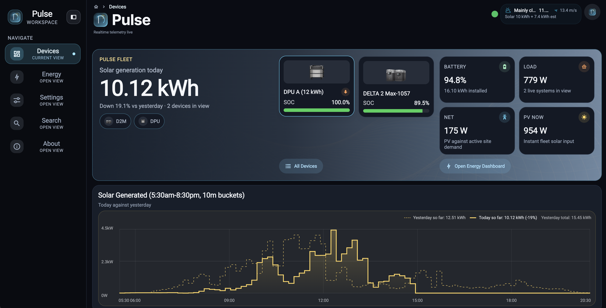
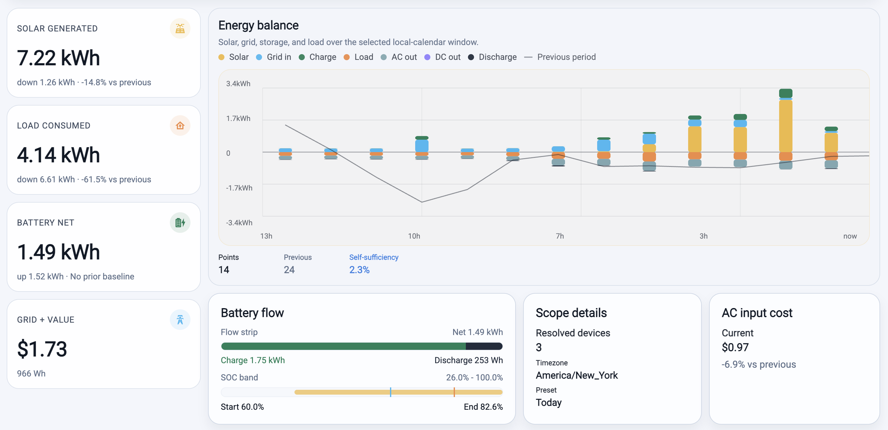
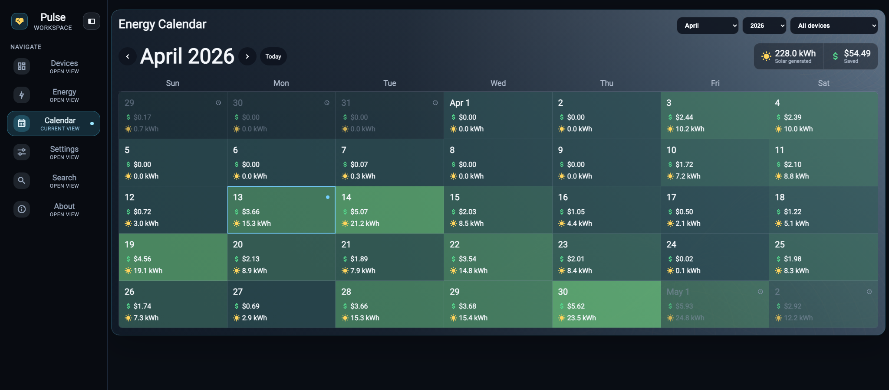
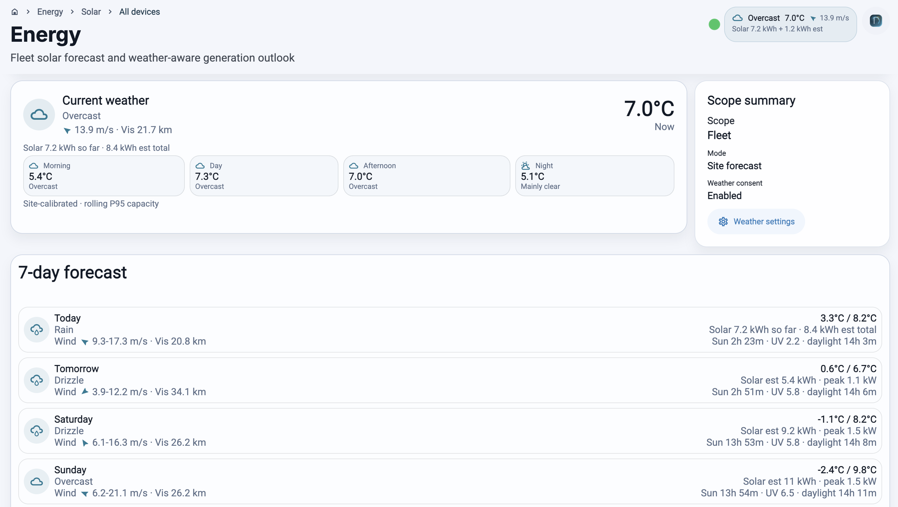

# EcoFlow Pulse


EcoFlow Pulse is a realtime energy control room for portable power systems. It
combines live provider telemetry, authenticated device access, historical
rollups, weather context, and solar forecasting into one operator-grade app for
web, iPhone, iPad, and Android.

> [!NOTE]
> Pulse is built around provider adapters for EcoFlow, Pecron, and Anker SOLIX,
> an Expo
> universal client, a Node REST BFF, Go gRPC/data services, NATS JetStream,
> Valkey, Postgres/Timescale, object archive storage, and Kubernetes-first
> deployment. Pecron and Anker SOLIX cloud support are read-only and
> unofficial/reverse-engineered.

## Current Product

- Realtime fleet and device dashboards for solar, battery state, load flow,
  AC/DC output, pack health, Storm Guard, and detailed PV input behavior.
- Auth-aware universal app with Keycloak OIDC, Expo Authorization Code + PKCE,
  same-tab iOS web sign-in, persisted session hydration, and reconnect-safe
  realtime subscriptions.
- `Energy` dashboard for fleet or single-device solar, load, battery, PV
  envelope, comparison windows, value estimates, and on-demand long-range
  history.
- `Energy Calendar` heatmap for fleet or device solar generation by local day,
  with generated-value totals and drill-through into the Energy dashboard.
- Weather and solar outlook widgets driven by saved profile location, Open-Meteo
  forecasts, yesterday verification, energy truth, and calibrated site/device
  forecast models.
- Solar history charts with local-calendar bounds, weather-derived sunrise and
  sunset windows, `Today so far` / `Yesterday so far` comparisons, and measured
  energy totals from persisted rollups.
- Energy-impact insights for measured solar generation using versioned avoided
  emissions, lifecycle/tree, and EV driving-energy factors.
- Local and cloud connection profiles so the same client can switch API,
  websocket, and OIDC endpoints together.

### App Overview

#### Fleet Dashboard



The fleet dashboard brings solar generation, device SOC, battery capacity, live
load, PV input, and day-over-day history into one operational view across active
systems.

#### Energy Balance



The energy view shows solar generation, site load, battery net flow, grid value,
self-sufficiency, SOC band movement, and scoped device/window details for the
selected local-calendar period.

#### Energy Calendar



The calendar view shows fleet or device solar generation by local day with
month navigation, heatmap tiles, generated-value totals, and direct
drill-through into the Energy dashboard for the selected date.

#### Solar Forecast



The forecast screen combines current weather, consent state, site/device scope,
calibrated production estimates, and a seven-day outlook so expected solar
generation is visible alongside weather context.

## Recent Important Updates (Apr 2026)

- Solar history charts now align `Today so far` values with matched
  `Yesterday so far` comparison semantics.
- Solar generation charts prefer weather-provided sunrise/sunset bounds and fall
  back to the local `06:00` -> `20:00` daylight window.
- Forecast retention moved into scheduler-managed weather/solar pruning and
  refresh work, with request-serving APIs kept traffic-focused.
- iOS Safari and Chrome sign-in now use a centralized same-tab PKCE redirect
  path, and the cloud public app image has been updated with that fix.
- Cloud/local switching, cloud ingress routing, live telemetry recovery, hosted
  public HA, and zonal/stateful cloud profiles have been hardened.
- Internal non-crypto hash usage has moved to `XXH3_128`, while security
  boundaries continue to use cryptographic hashing where required.
- Storm Guard and extended device system signals are surfaced from live device
  telemetry instead of inferred from weak solar or stale state.

## Supported Devices

Actively validated:

- DELTA Pro Ultra (DPU)
- DELTA 2 (D2)
- DELTA 2 Max (D2M)
- Pecron E1000LFP (`p11vxg`, read-only cloud telemetry)
- Anker SOLIX power stations and home-battery systems with mapped Cloud MQTT
  telemetry (`anker_solix`, read-only unofficial integration)

## Platform Capabilities

- Distributed ingest workers maintain one MQTT session per provider device using
  Valkey lease/fencing and publish canonical `TelemetryEnvelope` events to NATS
  JetStream.
- Projection, rollup, archive, replay, gap detection, gap repair, forecast
  verification, and scheduler workers keep realtime state, long-range history,
  raw archive data, and forecast quality loops moving independently.
- Timescale-backed minute/hour/day rollups are the authoritative history path;
  archive-to-rollup rebuild tools repair historical windows without destructive
  replay.
- The public Node BFF validates JWTs and exposes browser/mobile REST routes over
  internal Go gRPC services for telemetry, history, profile, weather, solar
  forecasts, inference, and device authorization.
- The dedicated websocket gateway serves initial snapshots from Valkey, streams
  NATS deltas, validates JWTs, and applies staged backpressure behavior.
- Local development runs on `k3d` with Helm-managed `pulse-platform` and
  `pulse-services`; cloud deployments target GKE with GCS archive storage,
  Keycloak, multi-replica public workloads, and cloud-specific overlays.

## Technology Stack

- **Client:** Expo, React Native, Expo Router, Tamagui, Vitest, Playwright,
  Maestro.
- **Public services:** Node/TypeScript REST BFF and realtime websocket gateway.
- **Data services:** Go gRPC API, ingest, projection, archive, replay, gap
  repair, rollups, scheduler, weather, solar forecast, and inference workers.
- **Storage and messaging:** Postgres/Timescale, NATS JetStream, Valkey +
  Sentinel, MinIO locally, GCS in cloud.
- **Platform:** Helm, k3d, GKE, CloudNativePG, Keycloak, Buf/Protobuf contracts.

## Quick Start

```bash
go test ./...
make dev-up
make platform-wait services-wait
```

Useful validation targets:

- `make test-pipeline-integration`
- `make test-proto-contract`
- `make test-web-e2e`
- `MAESTRO_EXPO_URL='exp://127.0.0.1:8081' make test-mobile-e2e`
- `make lint`

Useful deploy targets:

- `make local-up`
- `make local-deploy`
- `make cloud-up`
- `make cloud-refresh`
- `make services-image-push-cloud`
- `make public-images-push-cloud`

## Documentation

Developer docs follow Diataxis under `/docs`:

- [Developer Documentation Index](docs/README.md)
- [Architecture (Locked Plan)](docs/architecture/README.md)
- [Architecture Decision Records](docs/architecture/adr/README.md)
- [Configuration Reference](docs/reference/configuration.md)
- [Commands Reference](docs/reference/commands.md)
- [Telemetry Model](docs/reference/telemetry-model.md)
- [Solar Avoided Emissions Reference](docs/reference/solar-avoided-emissions.md)
- [Tree Equivalent Reference](docs/reference/tree-equivalent.md)
- [EV Database Report Reference](docs/reference/ev-us-europe-database-report.md)
- [Universal App README](apps/universal/README.md)

## Repository Layout

- `apps/universal`: Expo universal dashboard for web, iOS, and Android.
- `apps/pulse-platform`: public Node REST BFF over internal gRPC services.
- `apps/pulse-realtime-gateway`: public websocket gateway for live telemetry.
- `cmd/ecoflow-grpc-api`: internal gRPC API runtime.
- `cmd/ecoflow-ingest-worker`, `cmd/ecoflow-projection-worker`,
  `cmd/ecoflow-rollup-worker`, `cmd/ecoflow-archive-worker`: core telemetry
  workers.
- `cmd/ecoflow-replay-cli`, `cmd/ecoflow-gap-detector`,
  `cmd/ecoflow-gap-repair-worker`, `cmd/ecoflow-rollup-rebuild`,
  `cmd/ecoflow-archive-audit`, `cmd/ecoflow-archive-reconcile`: replay,
  repair, rebuild, and archive integrity tooling.
- `cmd/ecoflow-scheduler`, `cmd/ecoflow-solar-verifier`: background forecast
  refresh, pruning, and verification workers.
- `cmd/pulse-mqtt-emulator`, `cmd/pulse-mqtt-history-backfill`: local/dev
  telemetry emulation and history tooling.
- `internal/weatherd`, `internal/solarforecastd`, `internal/energydashboard`,
  `internal/telemetryquery`, `internal/rollupworker`: main Go service domains.
- `pkg/ecoflow`, `pkg/ecoflowmqtt`, `pkg/panelselect`: reusable provider,
  MQTT, and panel-selection packages.
