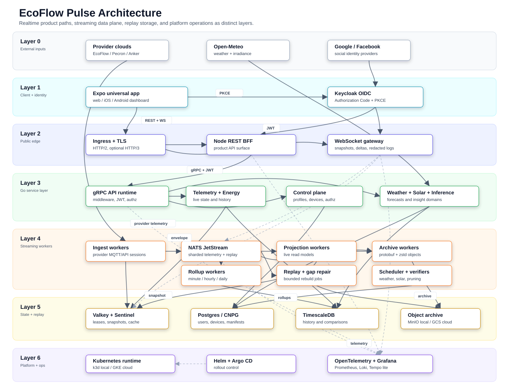

# Explanation: Architecture

EcoFlow Pulse separates concerns between provider API access, distributed
ingestion, snapshot/history serving, and universal client rendering.

## System diagram

## Layers

- Ingestion
  Provider API access via `pkg/ecoflow`, MQTT transport primitives via
  `pkg/ecoflowmqtt`, and distributed worker orchestration in
  `cmd/ecoflow-ingest-worker` / `internal/ingestworker`.

- Streaming and storage
  Canonical telemetry envelopes flow through NATS JetStream, then into Valkey
  live snapshots, Timescale rollups, and object archive.

- Public delivery
  Node REST (`apps/pulse-platform`) serves browser/app API requests and the
  dedicated websocket gateway (`apps/pulse-realtime-gateway`) handles
  snapshot-on-connect plus live deltas.

- Universal client
  Expo/Tamagui renders the operator-facing web/iOS/Android experience with
  snapshot-first realtime, rollup-backed history, and auth-aware routing.

## Why this shape

- keeps provider transport concerns isolated from product-facing delivery paths,
- lets ingest, projection, archive, and history evolve independently,
- preserves a clean boundary between public Node entrypoints and internal Go services,
- keeps the universal client focused on presentation rather than backend orchestration.

## Universal App Shell

For the Expo universal app, page layout should default to:

- top bar fixed at the top of the screen,
- scrollable body content below the top bar,
- content that remains usable on mobile-height and split-screen layouts without
  clipping.

Practical rule:

- information, settings, explainer, and other static/detail pages should use a
  `ScrollView` (or equivalent web overflow container) for their main body by
  default,
- only opt out of scrolling when the primary interaction model requires a
  fixed-viewport surface.
