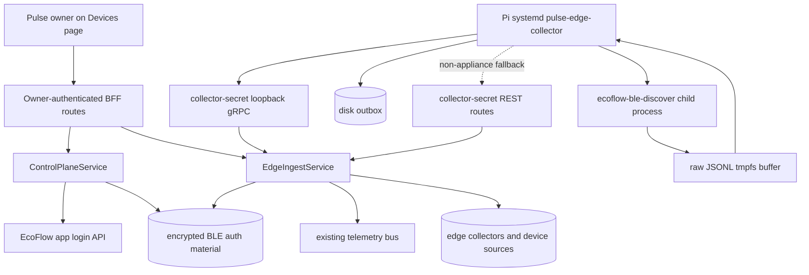

# EcoFlow BLE Edge Monitoring On Pi - Plan

## Goal Capsule

Productize the existing EcoFlow BLE discovery and monitoring path on the Raspberry Pi appliance so it runs as a resilient host service, logs operational state clearly, and lets Pulse owners discover, approve, and continuously ingest supported EcoFlow BLE devices from the Devices page.

Authority order for implementation is this plan, then repo `AGENTS.md` guidance, then existing edge collector/API/UI patterns. Stop and replan if real-Pi burn-in fails the protocol thresholds in KTD1, because that would reopen the local queue decision that v1 intentionally keeps out of scope.

---

## Product Contract

### Summary

Use the existing Pi-native collector architecture as the appliance protocol: a host-level `pulse-edge-collector` supervises `ecoflow-ble-discover`, uploads to the local platform over loopback gRPC, and persists failed uploads in the disk outbox. For devices that need full BLE authentication, Pulse obtains the EcoFlow app user ID through a secure owner-initiated EcoFlow login exchange and provisions only the derived BLE auth material to the Pi. Do not introduce Pi-side MQTT or a separate local queue for v1; keep NATS/JetStream inside the platform after ingestion.

### Requirements

- R1. The BLE collector runs as a resilient Pi appliance service with bounded restarts, structured logs, graceful shutdown, and persisted upload retry state.
- R2. Pulse owners can see local BLE collectors and discovered EcoFlow sources from the Devices page.
- R3. Pulse owners can approve/register a pending BLE source by choosing or confirming whether it links to an existing authorized device or creates/reuses a canonical Pulse device from the backend approval result.
- R4. Discovery works before approval, but telemetry from unapproved sources does not become user-visible device telemetry.
- R5. The implementation tolerates local API downtime and collector restarts without requiring MQTT or a Pi-side queue.
- R6. Logging and metrics make service health, BLE restart loops, auth failures, outbox behavior, discovery uploads, approval events, and telemetry drops diagnosable.
- R7. Raw BLE addresses, serials, collector secrets, setup tokens, provider device IDs, and user-linked identifiers are not exposed in UI URLs, GitHub-visible text, or normal owner-facing logs.
- R8. Setup tokens are owner-scoped, short-lived, one-use where feasible, revocable before enrollment, never logged in plaintext, and audited on create/use/failure.
- R9. The Devices page shows non-secret readiness states for not enrolled, waiting for first heartbeat, offline, auth failure/operator action required, no supported sources, pending source, stale source, approval in progress, linked, and approval failed.
- R10. V1 has an explicit supported-device matrix and an unsupported-device UX so owners are not left guessing when a nearby EcoFlow BLE device is outside current decoder support.
- R11. Pulse owners can connect EcoFlow account credentials through an authenticated Pulse flow so the backend can derive the EcoFlow BLE user ID; owners are not expected to find or type that opaque ID during normal setup.
- R12. EcoFlow account passwords and provider tokens used to derive BLE auth material are never persisted or logged; only encrypted derived BLE auth material and masked account metadata may be stored or sent to an enrolled collector.

### Scope Boundaries

- In scope: Pi host service hardening, existing gRPC/outbox path, owner-facing Devices page registration flow, EcoFlow BLE auth user ID derivation, backend/API test coverage, setup-token lifecycle hardening, docs, and real-Pi acceptance validation.
- Out of scope for v1: Pi-side MQTT, a new local NATS/JetStream queue, long-lived EcoFlow private-cloud sessions on the Pi, storing EcoFlow account passwords, MFA/captcha automation, pre-approval telemetry backfill, broad device-family protocol research beyond the current BLE discovery support, and a separate Settings-first collector management surface.
- If real-Pi burn-in shows the disk outbox cannot meet KTD1 thresholds, v1 blocks and the local queue decision is replanned rather than quietly expanding this scope.

---

## Planning Contract

### Key Technical Decisions

- KTD1. Direct loopback gRPC plus disk outbox is the authoritative Pi appliance protocol. The v1 pass gate is: tolerate at least 30 minutes of local API downtime, preserve queued uploads across collector restart, replay all persisted outbox entries without corrupt files, keep outbox size within configured bounds, and resume current telemetry after recovery. If those thresholds fail in real-Pi validation, do not ship by adding a hidden local queue; replan the transport boundary.
- KTD2. BLE scanning stays outside Kubernetes under `systemd`; the platform remains responsible for authorization, source approval, device linking, and publishing approved telemetry into the existing internal bus.
- KTD3. Pending edge device sources are the registration gate. Discovery can create or refresh pending sources, but telemetry is ignored until approval links the source to a canonical Pulse device ID.
- KTD4. Approval follows the existing backend contract: `ApproveDeviceSource` accepts an optional `device_id`; when present it links only to an admin-owned existing device, and when absent the backend creates or reuses a device from the source provider device ID and returns the canonical device ID. The UI must explain the outcome and never claim a new device was created before the response confirms it.
- KTD5. The Devices page is the owner workflow home for registration, not a full appliance operations console. It shows summarized collector readiness and source actions; detailed operational logs stay in `systemd` journal, service metrics, and existing admin/log surfaces.
- KTD6. Owner-visible source identity is privacy-preserving. Show model/display name, collector, last seen freshness, RSSI when useful, linked device state, and a masked stable source label; do not render raw BLE address, serial, or provider device ID.
- KTD7. Collector observability has three sinks in v1: structured host journal logs for Pi operators, owner-visible health derived from collector heartbeat/source status, and platform-side metrics for API/ingest accepted/dropped counts. Do not add a local Prometheus/textfile exporter unless KTD1 burn-in or ops review proves journal plus heartbeat is insufficient.
- KTD8. The normal EcoFlow BLE user ID source is an owner-initiated EcoFlow app login exchange in the platform. The backend calls EcoFlow's app login surface, extracts the returned account `userId`, discards the password and temporary token, stores the derived BLE user ID encrypted at rest, and exposes only masked readiness state to the universal app.
- KTD9. Pi enrollment provisions BLE auth material with the collector secret. The setup command may still be run from the Pi, but it should exchange the setup token for both `PULSE_EDGE_COLLECTOR_SECRET` and available `ECOFLOW_BLE_USER_ID` material, writing them to the root-owned service environment file; EcoFlow username/password must not be provided on the Pi command line in the normal flow.

### High-Level Technical Design

Approval state is intentionally simple: pending sources can be approved only while fresh, approval either links to an authorized existing device or returns the canonical device created/reused by the backend, and telemetry becomes ingestible only after the source status is `linked`.

### Initial Setup And Authentication Flow

1. The owner signs into Pulse and opens the Devices page Local BLE setup flow.
2. If the owner has not connected EcoFlow BLE auth, the UI asks for EcoFlow account credentials in an authenticated Pulse form. The platform exchanges those credentials with EcoFlow's app login API, extracts the returned account user ID, optionally validates the account by listing EcoFlow devices, then discards the password and temporary token.
3. Pulse stores only encrypted derived BLE auth material, such as the EcoFlow app `userId`, plus masked account metadata for readiness display. If EcoFlow login is blocked by MFA, captcha, region drift, or API changes, the plan keeps an advanced manual fallback for entering the user ID, with the same encrypted storage and redaction rules.
4. The owner creates a collector setup token from Devices. The token is shown only as an enrollment action and is not a long-lived credential.
5. The Pi operator runs the enrollment command or installer step with the Pulse setup token. The enrollment exchange returns or writes the collector secret and current BLE auth material into `/etc/pulse-edge/secret.env` with root ownership and restrictive permissions; EcoFlow email/password are never passed on the Pi command line.
6. On service start, `pulse-edge-collector` authenticates heartbeat with the collector secret before launching `ecoflow-ble-discover`. The child process inherits `ECOFLOW_BLE_USER_ID`; device serial comes from BLE manufacturer data, with `ECOFLOW_BLE_DEVICE_SERIAL` reserved for operator support when an advertisement lacks a usable serial.
7. Discovery creates pending BLE sources before approval. After the owner approves a fresh source, linked telemetry flows through the existing edge ingest path into canonical device views.

### Public Interfaces

- Owner-authenticated UI routes: create/list collectors, list device sources, approve a source, create/revoke setup tokens when backend support exists or is added in this plan, and connect/refresh EcoFlow BLE auth material.
- Collector-secret service routes: enroll collector, heartbeat, discovery upload, telemetry upload, and fetch collector config material when needed. Universal-app hooks must not call these collector upload routes.
- Existing gRPC RPCs remain the service contract: `CreateCollector`, `ListCollectors`, `EnrollCollector`, `Heartbeat`, `UploadDiscovery`, `ListDeviceSources`, `ApproveDeviceSource`, and `UploadTelemetryBatch`.
- Add a backend-owned EcoFlow BLE auth resolver contract that takes one-time EcoFlow account credentials, derives the app user ID, stores only encrypted derived material, and returns no password, token, raw user ID, or raw provider identifier to the universal app.
- Add universal-app typed schemas/hooks only for owner UI routes and sanitize any response fields that contain provider raw identifiers or BLE auth material.
- Add backward-compatible fields or routes only where required for owner-visible readiness, setup-token lifecycle, source freshness, masked source labels, or revocation.

### Sources And Existing Patterns

- `cmd/ecoflow-ble-discover/main.go` and `docs/how-to/discover-ecoflow-ble-devices.md` already define `-auth-user-id` / `ECOFLOW_BLE_USER_ID` and serial fallback behavior for full BLE auth.
- `cmd/ecoflow-ble-discover/ecoflow_active.go` builds the BLE auth request from the EcoFlow user ID plus device serial, so the user ID is required before full encrypted BLE auth can succeed.
- `cmd/pulse-edge-collector/main.go`, `deploy/pulse-edge/config.pi5.yaml`, and `deploy/pulse-edge/pulse-edge-collector.service` already establish the host collector, child process, environment file, loopback gRPC, and outbox runtime shape.
- `pkg/ecoflow/credentials.go` and `internal/provideradapter/ecoflow.go` model the existing public EcoFlow access-key integration; this is adjacent but does not provide the BLE app user ID.
- `https://github.com/tolwi/hassio-ecoflow-cloud/blob/main/custom_components/ecoflow_cloud/api/private_api.py` shows the EcoFlow app login shape used by a community integration: login returns `data.user.userId`, and that value is used for private app MQTT topic/client identity. Treat this as implementation guidance with fixtures and fallback, not as a stable official contract.

### Assumptions

- Occasional BLE packet loss is acceptable; durable replay starts at the upload/outbox boundary rather than at every individual BLE packet.
- EcoFlow's app login contract may drift; implementation must isolate it behind a small adapter with fixtures and a manual user ID fallback.
- Existing collector, BLE discovery, edge service, and edge database foundations are close enough to extend rather than replace.
- Documentation changes are required because runtime behavior, appliance setup, security posture, and owner registration flow are changing.

### Risks And Dependencies

- Setup-token hardening may require a small edge collector schema migration for expiry/revocation metadata.
- EcoFlow account login introduces a new private-provider trust boundary. The implementation must rate-limit attempts, redact failures, avoid password persistence, and document that app API changes can temporarily require the manual user ID fallback.
- Existing BFF responses currently include raw provider fields; implementation must either omit them from owner UI schemas or prove they cannot be displayed, logged, or routed.
- Hardware availability may limit validation breadth. If only one supported BLE family is physically tested, docs and UI copy must label the hardware-validated family separately from code-supported families.

---

## Implementation Units

### U1. Universal Edge API Client

- **Goal:** Add owner-facing API support for listing collectors, listing BLE device sources, approving/registering sources, and setup-token lifecycle actions.
- **Requirements:** R2, R3, R7, R8, R9, R11, R12
- **Dependencies:** Existing edge BFF routes and U3/U6 contract decisions.
- **Files:** `apps/universal/src/features/devices/api.ts`, `apps/universal/src/features/devices/hooks.ts`, `apps/universal/src/features/devices/schema.ts`, `apps/universal/src/features/devices/api.test.ts`, `apps/universal/src/features/integrations/api.ts`, `apps/universal/src/features/integrations/hooks.ts`, `apps/universal/src/features/integrations/schema.ts`, `apps/universal/src/features/integrations/schema.test.ts`
- **Approach:** Add typed schemas only for owner-authenticated routes. Omit or mask `providerDeviceId`, raw provider identifiers, EcoFlow user IDs, collector secrets, setup tokens after creation, and any BLE auth material at the UI schema boundary. Preserve stale data during refresh and expose loading, empty, error, submitting, stale, and success states, including EcoFlow-account-required readiness.
- **Patterns to follow:** Existing `useAvailableDevices`, available-device import hooks in `apps/universal/src/features/devices/`, and provider integration hooks in `apps/universal/src/features/integrations/`.
- **Test scenarios:** Schema parsing accepts collector/source health responses with masked labels; schema parsing rejects malformed status values; approval mutation refreshes source and collector queries; stale data remains visible during background refresh; raw provider identifiers and BLE auth material are not exposed through hook return values; EcoFlow auth status parses connected, missing, failed, and manual-fallback-needed states without exposing the raw user ID.
- **Verification:** Universal app device hooks can drive Local BLE UI without collector-secret routes or raw identifiers.

### U2. Devices Page Local BLE Registration Flow

- **Goal:** Extend the Devices page available-devices experience with a Local BLE section for setup, readiness, source disambiguation, and approval.
- **Requirements:** R2, R3, R7, R9, R10, R11, R12
- **Dependencies:** U1, U3, U6
- **Files:** `apps/universal/app/(tabs)/devices.tsx`, `apps/universal/src/features/devices/AvailableDevicesPanel.tsx`, `apps/universal/src/features/devices/api.test.ts`, `apps/universal/src/features/integrations/api.ts`, `apps/universal/src/features/integrations/hooks.ts`, `apps/universal/src/features/integrations/schema.ts`, `apps/universal/src/features/integrations/schema.test.ts`
- **Approach:** Keep Devices focused on registration. Show summarized collector readiness, pending/linked/stale sources, a Connect EcoFlow step when BLE auth material is missing, setup-token CTA when auth is ready but no collector is enrolled, and operator-action guidance without showing secrets. Approval requires a fresh source, shows a masked stable label plus model/RSSI/last seen, and lets the owner attach to an authorized existing device or continue with the backend create/reuse flow.
- **Patterns to follow:** Existing available-device panel composition, Pulse/Tamagui primitives, MaterialCommunityIcons, and app-owned status/empty-state patterns.
- **Test scenarios:** Missing-EcoFlow-auth state offers account connection before collector enrollment; EcoFlow login failure shows retry without retaining the submitted password in component state after submission settles; manual user ID fallback is available only as an advanced path and displays masked readiness after success; no-collector state offers setup-token creation and handles creation failure; waiting-for-heartbeat state preserves layout; pending fresh source enables approval; stale source disables approval until refreshed; owner can select existing device or create/reuse; approval failure and source-disappeared states show retry; linked source routes only through canonical UUID device ID; mobile and desktop layouts remain scrollable and non-overlapping.
- **Verification:** A Pulse owner can understand whether the Pi needs setup, whether a source is safe to approve, and which canonical device was linked after approval.

### U3. Backend Edge Contracts And Security Hardening

- **Goal:** Harden edge BFF/gRPC contracts for trust-boundary separation, setup-token lifecycle, approval behavior, duplicate discovery, and authorization.
- **Requirements:** R3, R4, R7, R8, R9, R12
- **Dependencies:** Existing edge service/store, U1 contract needs, and U6 BLE auth material storage.
- **Files:** `proto/pulse/edge/v1/edge.proto`, `cmd/ecoflow-grpc-api/edge_service.go`, `cmd/ecoflow-grpc-api/edge_service_test.go`, `internal/controlplane/store_postgres_edge.go`, `internal/controlplane/store_memory.go`, `internal/controlplane/edge_store_memory_test.go`, `deploy/db/migrations/`, `apps/pulse-platform/src/routes/edge.ts`, `apps/pulse-platform/src/grpc/edgeClient.ts`, `apps/pulse-platform/test/edge_routes.test.ts`
- **Approach:** Split owner-authenticated and collector-secret route handling in tests and docs. Add setup-token expiry/revocation if missing. Extend enrollment or a collector-secret config route so an enrolled Pi can receive current BLE auth material without universal-app access to collector routes. Preserve current approval semantics: existing admin-owned `device_id` links to that device; absent `device_id` creates or reuses a canonical device from the source and returns the linked UUID. Ensure unlinked telemetry is dropped intentionally and observable.
- **Patterns to follow:** Existing edge service store interfaces, `edgeStoreStatus` error mapping, route Zod schemas, and migration style.
- **Test scenarios:** Setup tokens expire and cannot be reused after enrollment; revoked setup token cannot enroll; setup token and collector secret are never returned except at creation/enrollment; enrollment returns BLE auth material only to the collector exchange and only when the owner has connected EcoFlow BLE auth; pending source becomes linked after approval; approval with unauthorized existing device fails; approval without `device_id` returns a canonical device ID; unlinked telemetry is dropped; duplicate discovery refreshes source metadata without duplicate rows; owner cannot list or approve another owner's source.
- **Verification:** Edge API boundaries are clear enough that the universal app never needs collector secrets and the host collector never needs user auth.

### U6. EcoFlow Account BLE Auth Material

- **Goal:** Add the secure backend path that derives the EcoFlow BLE user ID from an owner EcoFlow login and stores/provisions only derived auth material.
- **Requirements:** R7, R11, R12
- **Dependencies:** Existing provider credential encryption patterns and U3 setup-token enrollment contract.
- **Files:** `proto/pulse/controlplane/v1/control_plane.proto`, `cmd/ecoflow-grpc-api/controlplane_service.go`, `cmd/ecoflow-grpc-api/controlplane_service_test.go`, `internal/controlplane/store.go`, `internal/controlplane/store_postgres.go`, `internal/controlplane/store_memory.go`, `internal/controlplane/provider_config_test.go`, `deploy/db/migrations/`, `apps/pulse-platform/src/routes/integrations.ts`, `apps/pulse-platform/test/integrations_routes.test.ts`, `pkg/ecoflow/`, `internal/provideradapter/`
- **Approach:** Add an EcoFlow app-login adapter behind the Go control-plane service. The adapter exchanges one-time EcoFlow email/password with the EcoFlow app API, extracts `data.user.userId`, validates enough account context to prove the response belongs to an EcoFlow account, and returns no long-lived provider token to callers. Store the derived BLE user ID encrypted at rest in a purpose-specific control-plane record or encrypted credential material field; store only masked account metadata in JSON config. Keep the existing public API access-key credential flow intact, because it serves a different EcoFlow integration contract and does not currently provide the BLE app user ID.
- **Patterns to follow:** Existing provider credential encryption/redaction in `internal/controlplane/store_postgres.go`, provider route validation in `apps/pulse-platform/src/routes/integrations.ts`, EcoFlow signed-client isolation in `pkg/ecoflow`, and provider adapter interfaces in `internal/provideradapter/`.
- **Test scenarios:** Successful EcoFlow app login extracts the returned user ID and persists only encrypted derived material; invalid credentials return a redacted owner-facing error; password and temporary token are absent from store rows, API responses, logs, and test snapshots; repeated account connection rotates derived material and invalidates stale collector config version; manual user ID fallback stores the value through the same encrypted path; active public EcoFlow API credentials continue to work without being treated as BLE auth; rate limiting or attempt throttling prevents brute-force login attempts through Pulse.
- **Verification:** A backend test can prove the Pi enrollment path can obtain `ECOFLOW_BLE_USER_ID` without storing or returning an EcoFlow password, temporary token, raw user ID, or public API key material to owner-facing clients.

### U4. Pi Service Observability And Runtime Validation

- **Goal:** Make the Pi BLE service diagnosable and resilient through restarts, local API downtime, BLE contention, and BLE auth failures.
- **Requirements:** R1, R5, R6, R7, R9, R10, R12
- **Dependencies:** Existing `pulse-edge-collector`, `ecoflow-ble-discover`, U3 telemetry/drop observability, and U6 BLE auth material.
- **Files:** `cmd/pulse-edge-collector/main.go`, `cmd/pulse-edge-collector/main_test.go`, `cmd/ecoflow-ble-discover/`, `deploy/pulse-edge/config.pi5.yaml`, `deploy/pulse-edge/pulse-edge-collector.service`, `docs/how-to/run-pulse-edge-collector.md`, `docs/architecture/config-06-pi5-appliance.md`
- **Approach:** Extend enrollment/config handling so the collector can write or refresh `PULSE_EDGE_COLLECTOR_SECRET` and `ECOFLOW_BLE_USER_ID` in the service environment without logging either value. Verify or add structured log fields for service startup, BLE child restart/backoff, auth failure exit, heartbeat, discovery upload, telemetry accepted/dropped, outbox enqueue/flush/prune, and shutdown. Keep auth failures non-restartable. Treat device-busy/intermittently-unavailable as retryable with bounded backoff and owner-visible stale/offline status. Use journal plus heartbeat/source status as the v1 collector observability path unless validation proves a metrics exporter is required.
- **Patterns to follow:** Existing outbox atomic write tests, restart/backoff tests, systemd unit sandboxing, and Pi runtime defaults.
- **Test scenarios:** Enrollment writes collector secret and BLE user ID to the expected environment file with restrictive permissions and redacted logs; collector starts without EcoFlow password env vars; collector queues uploads during at least 30 minutes of API downtime and flushes after recovery; outbox survives collector restart; corrupt outbox files are isolated or logged without blocking later valid entries; BLE discovery restarts after transient failures; missing BLE user ID surfaces as owner/operator action instead of a raw auth failure; auth failure exits with the documented non-restartable code; device-busy/unavailable events classify as retryable and do not look like auth failure; shutdown preserves or drains in-flight upload state.
- **Verification:** Real Pi validation can prove KTD1 or clearly fail it before v1 ships.

### U5. Appliance Docs And Owner Runbook

- **Goal:** Document the end-to-end owner/operator path from Pi install through UI approval and telemetry verification.
- **Requirements:** R1, R2, R3, R6, R7, R8, R9, R10, R11, R12
- **Dependencies:** U2, U3, U4, U6
- **Files:** `docs/how-to/run-pulse-edge-collector.md`, `docs/architecture/config-06-pi5-appliance.md`, `docs/reference/configuration.md`, relevant Pi appliance release/deploy docs
- **Approach:** Document install/enablement, EcoFlow account connection for BLE auth, setup-token creation and revocation, enrollment, secret-file permissions, service health checks, journal inspection, outbox inspection, API downtime recovery, BLE auth-failure remediation, supported-device matrix, unsupported-device UX, and the Devices page registration flow. Explain that normal setup does not require EcoFlow credentials on the Pi command line, while the advanced fallback can provide a manually obtained user ID through the same protected secret file. Keep every example sanitized.
- **Patterns to follow:** Existing Pi appliance docs and repo markdown lint rules.
- **Test scenarios:** A maintainer can follow the docs on a Pi appliance to connect EcoFlow, enroll a collector, discover a supported source, approve it, and verify telemetry; docs explain what owners see for missing EcoFlow auth, unsupported devices, stale sources, and auth failure; examples contain no serials, BLE addresses, account identifiers, tokens, local home paths, or device-specific topics.
- **Verification:** Documentation matches implemented behavior and passes markdown lint.

---

## Verification Contract

| Gate | Applies to | Done signal |
|---|---|---|
| Go edge and auth tests | U3, U4, U6 | `go test ./cmd/pulse-edge-collector ./cmd/ecoflow-grpc-api ./internal/edgecollector ./internal/controlplane -count=1` passes, including EcoFlow BLE auth material storage/provisioning coverage. |
| Go race tests | U3, U4, U6 | Race coverage passes for collector/outbox/service code when restart, queue, shutdown, credential rotation, or publish paths change. |
| Node BFF tests | U3, U6 | Edge and integration route tests cover collectors, setup-token lifecycle, EcoFlow account connection, device sources, approval, telemetry upload, and owner-vs-collector auth boundaries. |
| Universal app tests | U1, U2 | Typecheck, lint, and targeted device/edge/integration UI tests pass. |
| UI validation | U2 | Devices page is checked on mobile and desktop widths for scrollability, stable layout, accessible actions, and no sensitive identifiers in links. |
| Appliance artifacts | U4, U5 | Pi edge bundle packages binaries, config, unit file, and docs. |
| Real Pi acceptance | U2, U3, U4, U5, U6 | Boot/restart appliance, connect EcoFlow for BLE auth, simulate local API downtime and outbox replay, discover a declared supported EcoFlow BLE device, approve it in Devices, and verify telemetry reaches existing Pulse device views/logs. |

---

## Definition Of Done

- The plan's chosen protocol is implemented or confirmed as the production path: host `systemd` collector, loopback gRPC, and durable disk outbox.
- Pulse owners can view collector readiness, pending BLE sources, stale/unsupported states, and linked sources from the Devices page.
- Pulse owners can connect EcoFlow for BLE auth through Pulse, with manual user ID entry reserved for advanced recovery.
- Pulse owners can approve a source with a clear create-or-link outcome and only canonical UUID device routing after approval.
- Approved BLE sources continuously ingest telemetry into existing Pulse device surfaces.
- Setup tokens, EcoFlow BLE auth material, and Pi secrets follow the documented lifecycle, encryption, redaction, and local permission rules.
- Operational logs/metrics cover expected failure modes without leaking sensitive identifiers.
- Pi runbooks and architecture docs match implemented behavior.
- Relevant Go, Node, universal-app, lint, bundle, and real-Pi validation gates have passing evidence or documented blockers.
